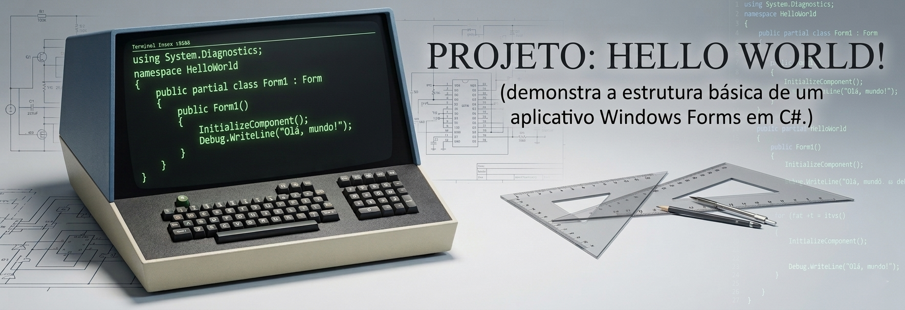

## 📖 Sobre o projeto

<p align="center">
    <picture>
        
     </picture>
</p>

Este projeto foi criado para demonstrar a estrutura básica de um aplicativo **Windows Forms** em **C#**, incluindo boas práticas de cabeçalho e uso de **Debug.WriteLine()**.

<p align="center">
    
    
    
    
</p>

## 🖥️ Pré-requisitos

- IDE [Microsoft Visual Studio](https://visualstudio.microsoft.com/pt-br/vs/community) (2017, 2019, 2022, **2026** ou superior)
- Estrutura [SDK .NET 10.0](https://dotnet.microsoft.com/pt-br/download/dotnet/10.0) (.NET 8, .NET 9, **.NET 10** ou superior)

## 🧭 1. Abrindo o Visual Studio (Splash Screen)

<p align="center">
    
</p>

* Ao abrir o [Microsoft Visual Studio](https://visualstudio.microsoft.com/pt-br/vs/community), aparece a [Splash Screen](https://learn.microsoft.com/en-us/samples/microsoft/windows-universal-samples/splashscreen) (tela de carregamento).
* Ela carrega componentes da IDE em segundo plano antes da interface principal aparecer.

## 🏠 2. Tela inicial (Comece agora!)

<p align="center">
    
</p>

Quando carregar, você verá:

* **Create a new project (Criar um projeto)** → clique aqui
* Open a project or solution (Abrir um projeto ou uma solução)
* Open a folder (Abrir uma pasta)
* Clone a repository (Clonar um repositório)

👉 Clique em **Create a new project (Criar um projeto)**

## 📦 3. Escolher o tipo de projeto (Template)

<p align="center">
    
</p>

Na tela de templates:

* No filtro superior:
    * Linguagem: **C# (C Sharp)**
    * Plataforma: **Windows**
    * Escolha: **Área de Trabalho**

* Escolha:
    * **Aplicativo do Windows Forms - Um modelo de projeto para criar um aplicativo WinForms (Windows Forms) do .NET**

👉 Clique em **Próximo**

💡 Esse template já cria a estrutura básica do programa automaticamente

## 🏷️ 4. Configurar o projeto

<p align="center">
    
    
</p>

* Preencha:
    * Nome do projeto: **HelloWorld**
    * Nome da solução: **helloworld-cs**
    * Framework: ex: .NET 8, .NET 9 ou **.NET 10**

👉 Clique em **Próximo** e **Criar**

## 🧩 5. Estrutura do projeto

<p align="center">
    
    
</p>

```cs
namespace HelloWorld
{
    public partial class Form1 : Form
    {
        public Form1()
        {
            InitializeComponent();

        }
    }
}
```

* Após criar:
    * Pressione a tecla **F7** para codificar
    * Dessa forma, você poderá acessar/abrir o arquivo principal: **Form1.cs**
    * O editor de código exibirá o **código padrão**

## 💻 6. Código Hello World
<p align="center">
    
    
</p>

```cs
// -----------------------------------------------------------------------
// <copyright file="Form1.cs" company="@fabasapro">
// Copyright (c) Fábio Santos. Todos os direitos reservados.
// Licenciado sob a Licença MIT. Veja o arquivo LICENSE na raiz do projeto.
// </copyright>
// -----------------------------------------------------------------------
using System.Diagnostics;
namespace HelloWorld
{
    public partial class Form1 : Form
    {
        public Form1()
        {
            InitializeComponent();
            Debug.WriteLine("Olá, mundo!");
        }
    }
}
```
👉 Esse código escreve texto no console de depuração: Debug: Olá, mundo!.

* Para rodar:
    * Clique no botão verde **▶️ HelloWorld** ou pressione **F5**
    * 🎉 Pronto! Seu primeiro programa em **C# (C-Sharp)** está funcionando

## 🚀 Conclusão

* Você aprendeu:
    * ✔ **Abrir o Visual Studio**
    * ✔ **Criar projeto C#**
    * ✔ **Entender estrutura**
    * ✔ **Escrever código**
    * ✔ **Executar programa**

## 👨‍💻 Autor

**Fábio Santos** (featuring **Eve Reeve**)

## 📄 Licença

* Copyright (c) Fábio Santos. All rights reserved.
* Este projeto está licenciado sob a MIT License. Veja o arquivo [LICENSE](./LICENSE) para mais detalhes.
