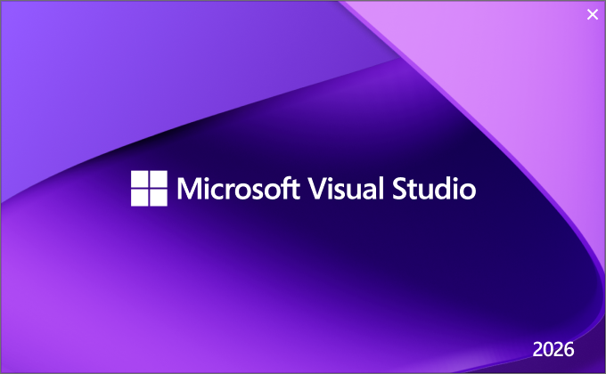
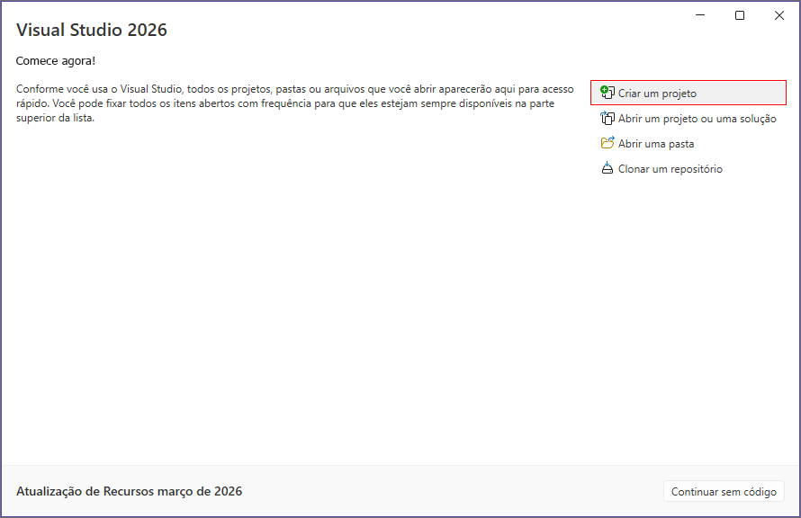
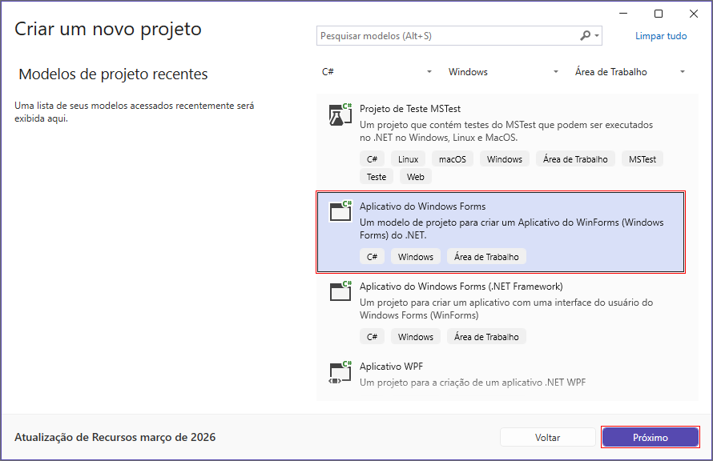
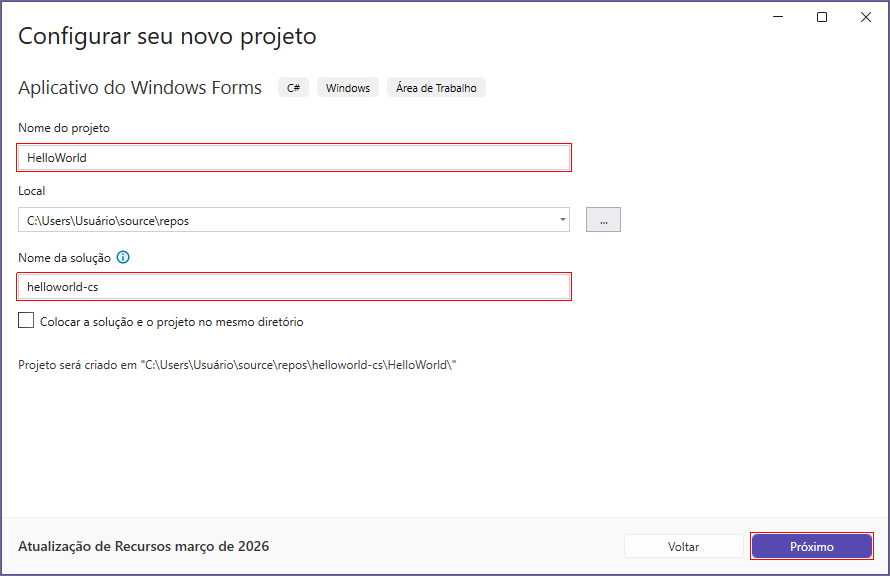
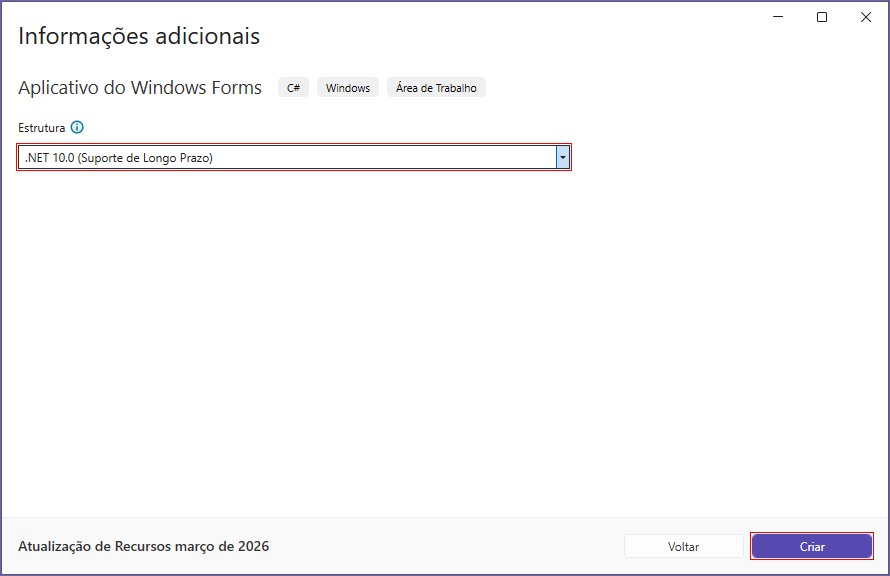
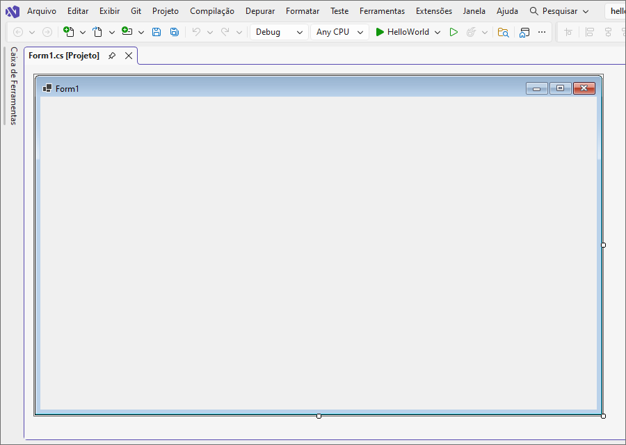
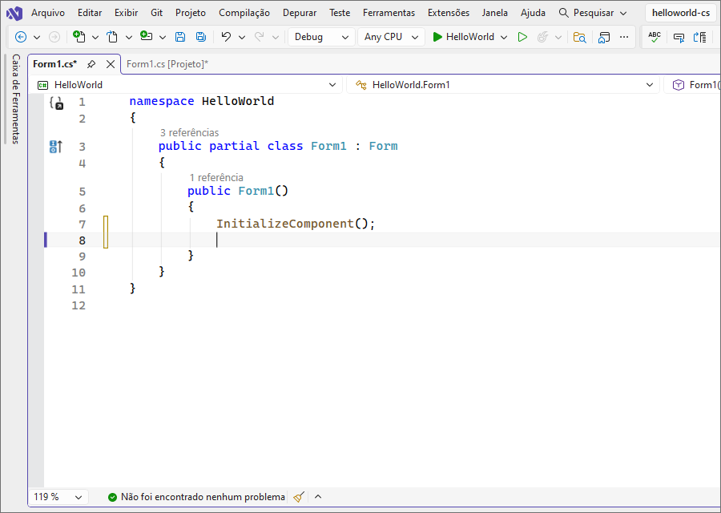
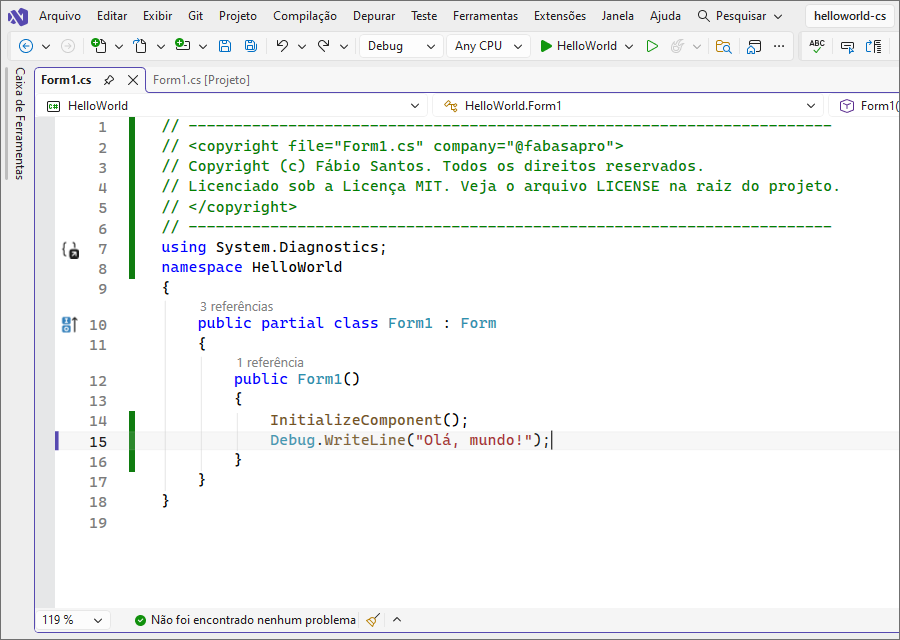
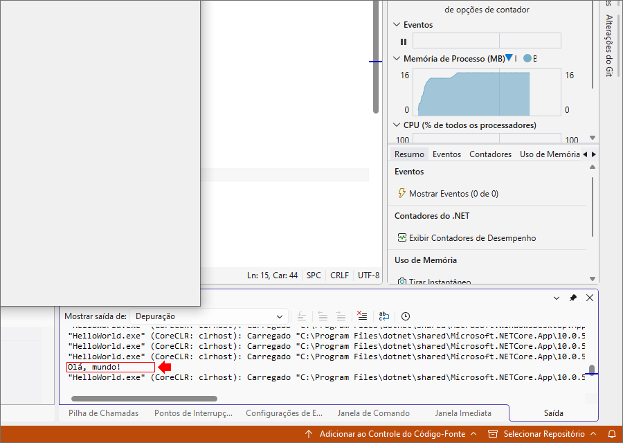

### 📖 Sobre o projeto

<p align="center"></p>
    
[](./LICENSE)
[](https://visualstudio.microsoft.com/vs/community)
[](https://dotnet.microsoft.com/download/dotnet/10.0)
[](https://www.microsoft.com/software-download)

Este é o meu **primeiro projeto desenvolvido em C# (C-Sharp)** e na estrutura **.NET 10.0**. Olá, mundo! 🚀

---

### 🖥️ Pré-requisitos

* IDE [Microsoft Visual Studio](https://visualstudio.microsoft.com/pt-br/vs/community) (2017, 2019, 2022, **2026** ou superior)
* Estrutura [SDK .NET 10.0](https://dotnet.microsoft.com/download/dotnet/10.0) (.NET 8, .NET 9, **.NET 10** ou superior)

### 🧭 1. Abrindo o Visual Studio (Splash Screen)

[](./splashscreen.png)

* Ao abrir o [Microsoft Visual Studio](https://visualstudio.microsoft.com/vs/community), aparece a [Splash Screen](./splashscreen.png) (tela de carregamento).
* Ela carrega componentes da [IDE](https://visualstudio.microsoft.com/s/community) em segundo plano antes da interface principal aparecer.

### 🏠 2. Tela inicial (Comece agora!)

[](./visualstudio.png)

* Quando carregar, você verá:
    * **Create a new project (Criar um projeto)** → clique aqui
    * Open a project or solution (Abrir um projeto ou uma solução)
    * Open a folder (Abrir uma pasta)
    * Clone a repository (Clonar um repositório)

👉 Clique em **Create a new project (Criar um projeto)**

### 📦 3. Escolher o tipo de projeto (Template)

[](./createnewproject.png)

* No filtro superior:
    * Linguagem (Idioma): **C# (C Sharp)**
    * Plataforma (Plataforma): **Windows**
    * Project types (Tipos de Projeto): **Área de Trabalho**
    * **Aplicativo do Windows Forms - Um modelo de projeto para criar um aplicativo WinForms (Windows Forms) do .NET**

👉 Clique em **Próximo**

💡 Esse template já cria a estrutura básica do programa automaticamente

### 🏷️ 4. Configurar o projeto

[](./settings.png)
[](./structure.png)

* Preencha:
    * Nome do projeto: **HelloWorld**
    * Nome da solução: **helloworld-cs**
    * Framework: ex: .NET 8, .NET 9 ou **.NET 10**

👉 Clique em **Próximo** e **Criar**

## 🧩 5. Estrutura do projeto

[](./formdesigner.png)

* Após criar:
    * Pressione a tecla **F7** para codificar
    * Dessa forma, você poderá acessar/abrir o arquivo principal: **Form1.cs**
    * O editor de código exibirá o **código padrão**

[](./formcode.png)

```cs
namespace HelloWorld
{
    public partial class Form1 : Form
    {
        public Form1()
        {
            InitializeComponent();

        }
    }
}
```

### 💻 6. Código Hello World

[](./sample.png)

```cs
// -----------------------------------------------------------------------
// <copyright file="FileName.cs" company="CompanyOrBusinessName">
// Copyright (c) YourFirstAndLastName. Todos os direitos reservados.
// Licenciado sob a Licença MIT. Veja o arquivo LICENSE na raiz do projeto.
// </copyright>
// -----------------------------------------------------------------------
using System.Diagnostics;
namespace HelloWorld
{
    public partial class Form1 : Form
    {
        public Form1()
        {
            InitializeComponent();
            Debug.WriteLine("Olá, mundo!");
        }
    }
}
```

* Para rodar:
    * Clique no botão verde **▶️ HelloWorld** ou pressione **F5**
    * 🎉 Pronto! Seu primeiro programa em **C# (C-Sharp)** está funcionando

[](./out.png)

👉 Esse código escreve texto no console de depuração: Debug: Olá, mundo!.

---

### 🚀 Conclusão

* Você aprendeu:
    * ✔ **Abrir o Visual Studio**
    * ✔ **Criar projeto C#**
    * ✔ **Entender estrutura**
    * ✔ **Escrever código**
    * ✔ **Executar programa**

### 👨‍💻 Autor

**Fábio Santos** (featuring **Eve Reeve**)

### 📄 Licença

* Copyright (c) Fábio Santos. All rights reserved.
* Este projeto está licenciado sob a MIT License. Veja o arquivo [LICENSE](./LICENSE) para mais detalhes.
